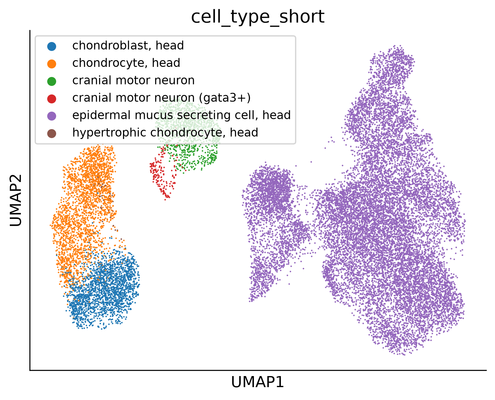
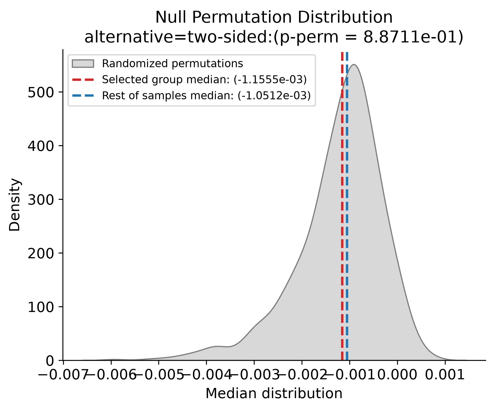

# scRNA-seq Analytical Toolkit (Master's Thesis Showcase)

[](LICENSE)
[](https://www.python.org/)
[](https://quarto.org/)
[]()

A modular Python framework for Single-Cell RNA-seq (scRNA-seq) processing, temporal trend modeling, stratified differential expression, hypothesis testing, and publication-ready visualization.

Developed as part of the Master's Thesis:  
> *"Computational approaches to study the maintenance of neuronal identity and plasticity during aging"*  
> **Author:** Pablo Manuel López Ruiz

---

## Context & Overview

Due to intellectual property (IP) and confidentiality restrictions on the original research project, the primary thesis dataset cannot be publicly distributed. This repository serves as a **reproducible public demonstration and benchmark** of the complete computational framework using an open-access developmental single-cell dataset from *Danio rerio* (zebrafish head tissue).

The repository contains:
1. A modular, reusable Python library (`toolkit.py`).
2. A testing notebook (`test_toolkit.qmd` with rendered version `test_toolkit.html`).
3. Annotation and testing metadata (`tf.txt`, `tf_cell_types.pkl`).

---

## Visual Overview

| Cell Type UMAP Projection | Permutation Test Null Distribution |
| :---: | :---: |
|  |  |
| *Single-cell UMAP projection colored by annotated cranial cell populations.* | *Monte Carlo permutation test comparing temporal slopes against randomized null distribution.* |

---

## Repository File Structure

The tracked files in this repository are structured as follows:

| File | Description |
| :--- | :--- |
| **`toolkit.py`** | Modular Python library containing all core analytical functions. |
| **`test_toolkit.qmd`** | Quarto workflow notebook demonstrating the complete pipeline on *Danio rerio* data ([*Duran et. al, 2025* publication](https://cellxgene.cziscience.com/collections/4ea9a90e-1dad-4c67-b1e3-8488ab7dc269)). |
| **`test_toolkit.html`** | HTML report with executed outputs and figures. |
| **`tf.txt`** | List of 1,820 zebrafish transcription factors from EZRC TFDB. |
| **`tf_cell_types.pkl`** | Randomized dictionary of transcription factors per cell type. |
| **`requirements.txt`** | Python dependencies required to run the toolkit and notebook. |
| **`LICENSE`** | GNU General Public License (GPL) terms. |

---

## Analytical Capabilities (`toolkit.py`)

The pipeline covers the complete scRNA-seq downstream workflow:

- **Quality Control & Preprocessing (`qc_and_preprocess`)**: Cell viability filtering by mitochondrial and ribosomal fractions, library size scaling, and `log1p` stabilization.
- **Sample Distribution Profiling (`plot_sample_distributions`)**: Dual discrete stage profiling and continuous cell density estimations with percentile boundaries.
- **Dimensionality Reduction (`compute_dimred`)**: Principal Component Analysis (with variance-explained elbow curves) and UMAP projections colored by categorical or continuous variables.
- **Stratified Differential Expression (`run_stratified_dea`)**: Cell-type-stratified DEA using Wilcoxon rank-sum testing across experimental/developmental stages.
- **Scientific Volcano Plots (`plot_volcano`)**: 6-tier significance and fold-change stratification with automatic label adjustment (`adjustText`).
- **Temporal Linear Modeling (`compute_temporal_slopes`)**: Per-gene regression slopes across developmental timepoints, categorizing target factors, all TFs, and background genes.
- **Monte Carlo Hypothesis Testing (`run_tests`)**: Two-sided permutation tests (1,000+ iterations) and Mann-Whitney U tests comparing target subsets against null empirical distributions.
- **Cell-Type Specific Dynamics (`compute_celltype_slopes_and_zscores`, `plot_heatmap_with_highlights`)**: Cell-type temporal rates standardized into Z-scores, visualized via clustered heatmaps with black-bordered terminal selector / marker highlighting.

---

## Quickstart & Reproduction

### Prerequisites
- Python 3.10+ (tested on Python 3.12)
- [Quarto CLI](https://quarto.org/) (1.4+)

### Installation
```bash
git clone https://github.com/pabloLopezRuiz/TFM_public.git
cd TFM_public

python3 -m venv .venv
source .venv/bin/activate
pip install -r requirements.txt  # scanpy, anndata, pandas, numpy, scipy, matplotlib, seaborn, adjustText
```

### Viewing / Rendering the Report
To view the report, simply open `test_toolkit.html` in any web browser.  
To re-render the report from source:
```bash
quarto render test_toolkit.qmd
```

---

- **Artificial Intelligence (Gemini)** was employed to assist in extracting and modularizing the functions from the author's original scripts`toolkit.py`.
- AI was also utilized to refactor code structure, apply rigorous type hinting and docstrings, ensure PEP 8 compliance.
- The underlying experimental methodology, scientific logic, analytical design, and domain-specific biological hypotheses remain the original intellectual work of the author.

---

## License

This project is released under the **GNU General Public License (GPL)**. See [LICENSE](LICENSE) for details.
